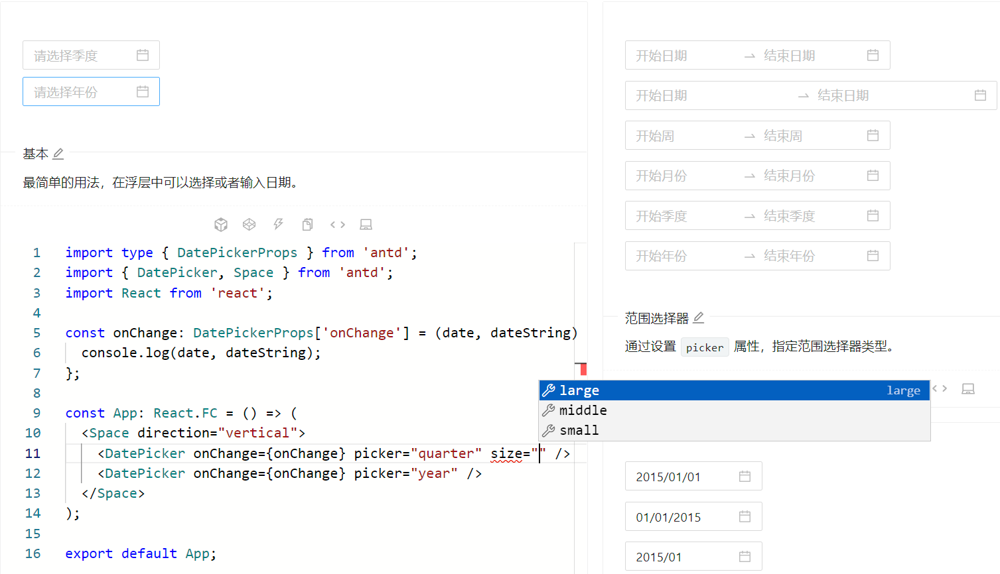
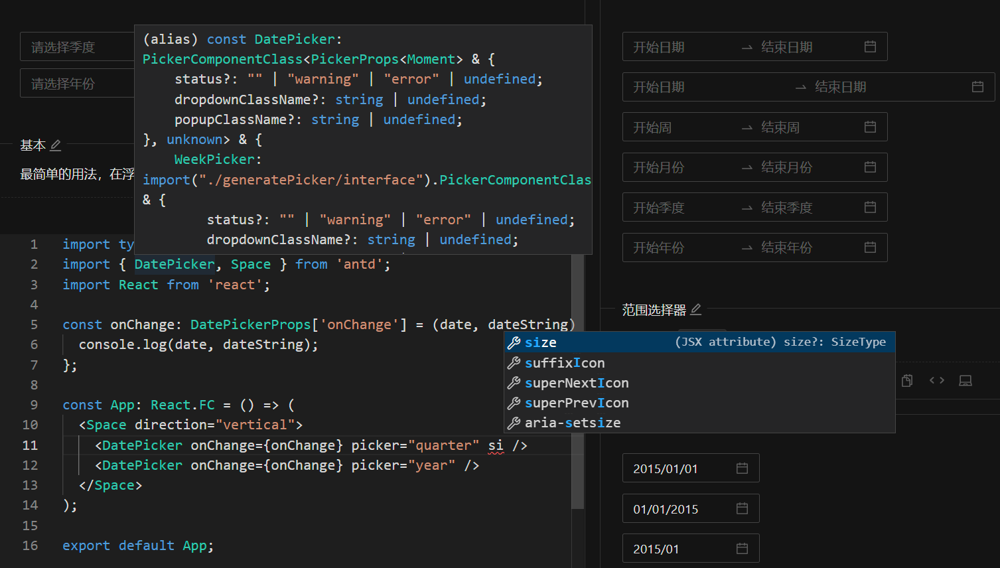

# ant-design runner

## 简介

一个 [ant.design](https://ant.design/index-cn) 网站插件，可以帮助你在浏览组件时编辑示例代码并 `ctrl/⌘ + s` 运行查看，无需跳转 `CodeSandbox` 或者 `CodePen` 等网站。

## 功能

- 编辑示例代码
- 运行查看
- ts 类型
- 智能提示

## 版本

```json
{
  "devDependencies": {
    "@types/react": "^17.0.52",
    "@types/react-dom": "^17.0.18",
    "antd": "^4.24.2",
    "monaco-editor": "^0.34.1"
  }
}
```

## 支持

- [ant.design](https://ant.design)
- [ant-design.antgroup.com](https://ant-design.antgroup.com)
- [ant-design.gitee.io](https://ant-design.gitee.io)



